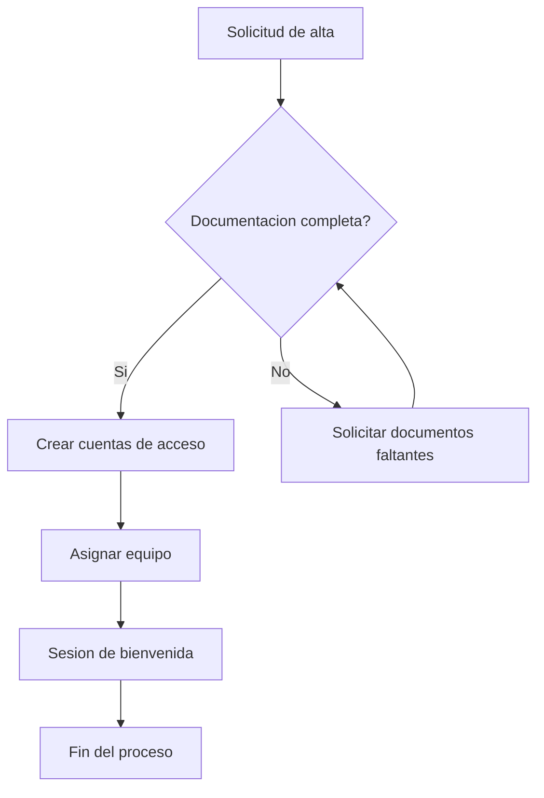
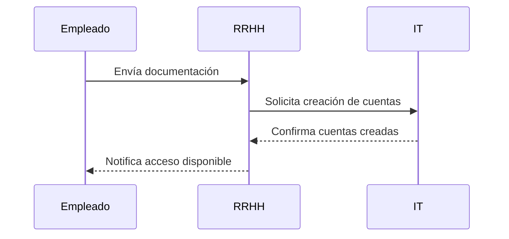

# Manual de proceso — Ejemplo

Este documento de ejemplo contiene texto normal, una tabla y dos diagramas
Mermaid, para comprobar que el pipeline de conversión funciona correctamente.

## 1. Introducción

El siguiente flujo resume el proceso de onboarding de un nuevo empleado:

## 2. Tabla de responsables

| Fase                  | Responsable        | Plazo estimado |
|-----------------------|---------------------|----------------|
| Alta en el sistema    | Recursos Humanos    | 1 día          |
| Asignación de equipo  | IT                  | 2 días         |
| Sesión de bienvenida  | Manager directo     | 1 semana       |

## 3. Diagrama de secuencia

A continuación se muestra la interacción entre los sistemas implicados:

## 4. Conclusión

Este flujo garantiza una incorporación ordenada y trazable de cada nuevo
empleado, con responsables claramente definidos en cada fase.
