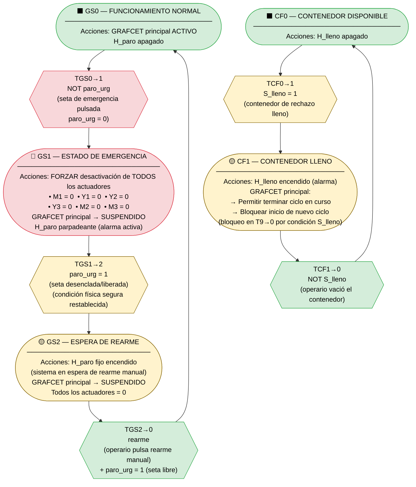
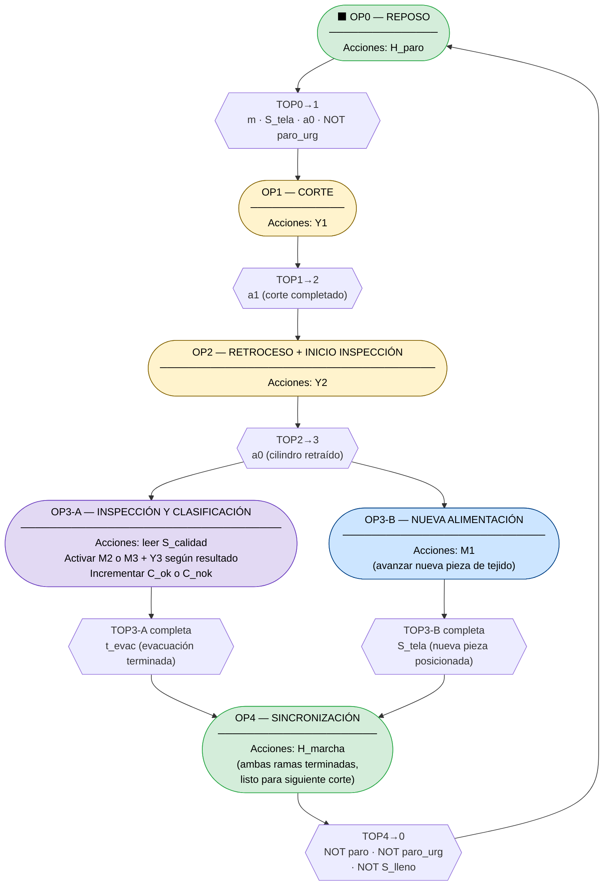

---
markdown:
  image_dir: /assets
  path: output.md
  ignore_from_front_matter: true
  absolute_image_path: false
---

# Solución GRAFCET: Célula de Corte y Clasificación de Piezas Textiles

## 1. Análisis del Proceso

### 1.1 Croquis funcional de la célula

```
┌─────────────────────────────────────────────────────────────────────┐
│                    CÉLULA DE CORTE Y CLASIFICACIÓN                   │
│                                                                       │
│  [ROLLO]──►[CINTA ENTRADA M1]──►[ESTACIÓN CORTE]──►[INSPECCIÓN]     │
│                                   Cilindro Y1/Y2    S_calidad        │
│                                                         │             │
│                                              ┌──────────┴──────────┐ │
│                                              ▼                     ▼ │
│                                    [CINTA SALIDA A]      [CINTA B]   │
│                                    Piezas OK (M2)     Piezas NOK(M3) │
│                                    ──►Almacén         ──►Contenedor  │
└─────────────────────────────────────────────────────────────────────┘
```

### 1.2 Fases del ciclo completo

| Fase | Descripción | Tipo |
|------|-------------|------|
| **Reposo** | Sistema en espera de orden de marcha | Inicial |
| **Alimentación** | Cinta avanza tejido hasta posición de corte | Secuencial |
| **Corte (avance)** | Cilindro desciende y corta la pieza | Secuencial |
| **Corte (retroceso)** | Cilindro asciende a posición de reposo | Secuencial |
| **Inspección** | Sistema de visión evalúa la pieza | Secuencial |
| **Clasificación** | Decisión OK/NOK → **BIFURCACIÓN en O** | Decisión |
| **Evacuación OK** | Pieza válida sale por cinta A | Rama A |
| **Evacuación NOK** | Pieza defectuosa sale por cinta B | Rama B |
| **Cierre de ciclo** | Convergencia y retorno al inicio | Convergencia |

---

## 2. Tablas de Entradas y Salidas

### 2.1 Entradas (Sensores y Pulsadores)

| Referencia | Descripción | Tipo | Notas |
|------------|-------------|------|-------|
| `m` | Pulsador de marcha | Digital NA | Arranque del ciclo automático |
| `paro` | Pulsador de paro normal | Digital NA | Detención al final de ciclo |
| `paro_urg` | Seta de emergencia | Digital NC (activa a 0) | Parada inmediata de seguridad |
| `S_tela` | Sensor de presencia de tejido en posición de corte | Digital NA | Inductivo o fotoeléctrico |
| `S_rollo` | Sensor de presencia de rollo en alimentación | Digital NA | Detección de fin de material |
| `a0` | Final de carrera cilindro de corte RETRAÍDO | Digital NA | Posición de reposo cilindro |
| `a1` | Final de carrera cilindro de corte AVANZADO | Digital NA | Carrera completa de corte |
| `S_calidad` | Sistema de visión: 1=OK, 0=NOK | Digital | Resultado de inspección |
| `b0` | Desviador en posición reposo (hacia cinta A) | Digital NA | Posición por defecto |
| `b1` | Desviador activado (hacia cinta B) | Digital NA | Posición de rechazo |
| `S_lleno` | Sensor nivel contenedor de rechazo lleno | Digital NA | Seguridad por desbordamiento |
| `rearme` | Pulsador de rearme tras emergencia | Digital NA | Requiere acción manual del operario |
| `t_insp` | Temporizador de inspección completada | Temporizado | Tiempo de análisis del sensor de visión |
| `t_evac` | Temporizador de evacuación completada | Temporizado | Tiempo de salida de pieza por cinta |

### 2.2 Salidas (Actuadores e Indicadores)

| Referencia | Descripción | Tipo | Notas |
|------------|-------------|------|-------|
| `M1` | Motor cinta de entrada | Digital | Alimentación de tejido |
| `Y1` | Electroválvula avance cilindro de corte | Digital | Acción de corte |
| `Y2` | Electroválvula retroceso cilindro de corte | Digital | Retorno tras corte |
| `Y3` | Electroválvula cilindro desviador (→ cinta B) | Digital | Activado = posición NOK |
| `M2` | Motor cinta de salida A (piezas OK) | Digital | Evacuación piezas válidas |
| `M3` | Motor cinta de salida B (piezas NOK) | Digital | Evacuación piezas defectuosas |
| `H_marcha` | Piloto luminoso VERDE — sistema en marcha | Digital | Indicación de estado |
| `H_paro` | Piloto luminoso ROJO — sistema parado/emergencia | Digital | Indicación de alarma |
| `H_lleno` | Piloto luminoso AMARILLO — contenedor lleno | Digital | Señalización de incidencia |
| `C_ok` | Contador de piezas válidas (acción de conteo) | Acción interna | Trazabilidad por turno |
| `C_nok` | Contador de piezas defectuosas | Acción interna | Trazabilidad por turno |

---

## 3. GRAFCET Completo — Funcionamiento Normal

### 3.1 Diagrama GRAFCET principal

```mermaid
flowchart TD
    %% =============================================
    %% GRAFCET PRINCIPAL - Célula Corte Textil
    %% =============================================

    %% --- ETAPA INICIAL ---
    E0(["⬛ E0 — REPOSO INICIAL\n────────────────────\nAcciones: H_paro\n(piloto rojo = sistema parado)"])

    %% Transición 0→1
    T01{{"T0→1\nm · S_tela · a0\n· NOT paro_urg\n· NOT S_lleno"}}

    %% --- ETAPA 1: AVANCE CINTA ---
    E1(["E1 — AVANCE CINTA DE ENTRADA\n────────────────────────────\nAcciones: M1, H_marcha"])

    %% Transición 1→2
    T12{{"T1→2\nS_tela\n(pieza en posición de corte)"}}

    %% --- ETAPA 2: PARADA CINTA ---
    E2(["E2 — PARADA CINTA / POSICIONADO\n────────────────────────────────\nAcciones: H_marcha\n(M1 desactivado)"])

    %% Transición 2→3
    T23{{"T2→3\na0\n(cilindro retraído confirmado)"}}

    %% --- ETAPA 3: AVANCE CILINDRO CORTE ---
    E3(["E3 — AVANCE CILINDRO DE CORTE\n──────────────────────────────\nAcciones: Y1, H_marcha"])

    %% Transición 3→4
    T34{{"T3→4\na1\n(cilindro avanzado = corte completado)"}}

    %% --- ETAPA 4: RETROCESO CILINDRO ---
    E4(["E4 — RETROCESO CILINDRO DE CORTE\n─────────────────────────────────\nAcciones: Y2, H_marcha"])

    %% Transición 4→5
    T45{{"T4→5\na0\n(cilindro completamente retraído)"}}

    %% --- ETAPA 5: INSPECCIÓN ---
    E5(["E5 — INSPECCIÓN DE CALIDAD\n───────────────────────────\nAcciones: H_marcha\n(activar sensor visión, esperar t_insp)"])

    %% Transición 5→6
    T56{{"T5→6\nt_insp · S_calidad = 1\n(pieza OK)"}}

    %% Transición 5→7
    T57{{"T5→7\nt_insp · S_calidad = 0\n· NOT S_lleno\n(pieza NOK)"}}

    %% =============================================
    %% RAMA A — PIEZA OK
    %% =============================================
    E6(["E6 — EVACUACIÓN PIEZA VÁLIDA\n─────────────────────────────\nAcciones: M2, C_ok↑, H_marcha\n(cinta A en marcha, incrementar contador OK)"])

    %% Transición 6→9
    T69{{"T6→9\nt_evac\n(tiempo de evacuación por cinta A completado)"}}

    %% =============================================
    %% RAMA B — PIEZA NOK
    %% =============================================
    E7(["E7 — ACTIVAR DESVIADOR\n───────────────────────\nAcciones: Y3, H_marcha\n(desviador → posición cinta B)"])

    %% Transición 7→8
    T78{{"T7→8\nb1\n(desviador en posición B confirmado)"}}

    E8(["E8 — EVACUACIÓN PIEZA DEFECTUOSA\n──────────────────────────────────\nAcciones: M3, C_nok↑, H_marcha\n(cinta B en marcha, incrementar contador NOK)"])

    %% Transición 8→9
    T89{{"T8→9\nt_evac\n(tiempo de evacuación por cinta B completado)"}}

    %% =============================================
    %% ETAPA DE CONVERGENCIA
    %% =============================================
    E9(["E9 — REPOSICIÓN / FIN DE CICLO\n───────────────────────────────\nAcciones: H_marcha\n(desactivar Y3 si estaba activo,\nesperar condición de reinicio)"])

    %% Transición 9→0 (cierre de ciclo automático)
    T90{{"T9→0\nS_rollo · NOT paro · NOT S_lleno\n· NOT paro_urg\n(hay material y no hay condición de paro)"}}

    %% Transición 9→0_fin (paro normal al final de ciclo)
    T90stop{{"T9→STOP\nNOT S_rollo OR paro\n(sin material o paro solicitado)"}}

    %% =============================================
    %% FLUJO PRINCIPAL
    %% =============================================
    E0 --> T01 --> E1 --> T12 --> E2 --> T23 --> E3 --> T34 --> E4 --> T45 --> E5

    %% DIVERGENCIA EN O
    E5 --> T56 --> E6
    E5 --> T57 --> E7 --> T78 --> E8

    %% CONVERGENCIA EN O
    E6 --> T69 --> E9
    E8 --> T89 --> E9

    %% CIERRE DE CICLO
    E9 --> T90 --> E0
    E9 --> T90stop --> E0

    %% =============================================
    %% ESTILOS VISUALES
    %% =============================================
    style E0 fill:#d4edda,stroke:#28a745,color:#000
    style E1 fill:#cce5ff,stroke:#004085,color:#000
    style E2 fill:#cce5ff,stroke:#004085,color:#000
    style E3 fill:#fff3cd,stroke:#856404,color:#000
    style E4 fill:#fff3cd,stroke:#856404,color:#000
    style E5 fill:#e2d9f3,stroke:#6f42c1,color:#000
    style E6 fill:#d1ecf1,stroke:#0c5460,color:#000
    style E7 fill:#f8d7da,stroke:#721c24,color:#000
    style E8 fill:#f8d7da,stroke:#721c24,color:#000
    style E9 fill:#d4edda,stroke:#28a745,color:#000
    style T01 fill:#ffffff,stroke:#6c757d,color:#000
    style T12 fill:#ffffff,stroke:#6c757d,color:#000
    style T23 fill:#ffffff,stroke:#6c757d,color:#000
    style T34 fill:#ffffff,stroke:#6c757d,color:#000
    style T45 fill:#ffffff,stroke:#6c757d,color:#000
    style T56 fill:#d1ecf1,stroke:#0c5460,color:#000
    style T57 fill:#f8d7da,stroke:#721c24,color:#000
    style T69 fill:#d1ecf1,stroke:#0c5460,color:#000
    style T78 fill:#f8d7da,stroke:#721c24,color:#000
    style T89 fill:#f8d7da,stroke:#721c24,color:#000
    style T90 fill:#d4edda,stroke:#28a745,color:#000
    style T90stop fill:#ffeeba,stroke:#856404,color:#000
```



---

### 3.2 GRAFCET de Seguridad (Parada de Emergencia y Contenedor Lleno)

> **Nota técnica:** Según IEC 60848, la gestión de emergencias se implementa preferentemente mediante un **GRAFCET de nivel superior (Macro-etapa de seguridad)** que fuerza el estado del GRAFCET principal, o mediante una **acción de forzado** que suspende el GRAFCET operativo. A continuación se muestra el GRAFCET de seguridad independiente.



---

### 3.3 GRAFCET de Paralelismo (Optimización: solapamiento de ciclos)

> Este GRAFCET resuelve la pregunta 12 del Bloque 4, mostrando la estructura de **secuencias simultáneas** para solapar la evacuación de una pieza con la alimentación de la siguiente.



---

## 4. Descripción Detallada de Etapas y Transiciones

### 4.1 GRAFCET Principal — Etapa por etapa

| Etapa | Nombre | Acciones activas | Justificación |
|-------|--------|-----------------|---------------|
| **E0** | Reposo inicial | `H_paro` | Estado seguro por defecto; sistema detenido y señalizado |
| **E1** | Avance cinta entrada | `M1`, `H_marcha` | Motor arrastra el tejido hacia la cuchilla |
| **E2** | Posicionado / parada cinta | `H_marcha` | M1 se desactiva; tejido en posición exacta de corte |
| **E3** | Avance cilindro de corte | `Y1`, `H_marcha` | Electroválvula activa el pistón; cuchilla desciende y corta |
| **E4** | Retroceso cilindro | `Y2`, `H_marcha` | Electroválvula retrae el pistón; cuchilla sube |
| **E5** | Inspección de calidad | `H_marcha` | Sistema de visión analiza la pieza; se espera `t_insp` |
| **E6** | Evacuación pieza OK | `M2`, `C_ok↑`, `H_marcha` | Cinta A activa; contador de válidas incrementado |
| **E7** | Activar desviador | `Y3`, `H_marcha` | Pusher se desplaza hacia posición B antes de evacuar |
| **E8** | Evacuación pieza NOK | `M3`, `C_nok↑`, `H_marcha` | Cinta B activa; contador de rechazos incrementado |
| **E9** | Fin de ciclo / convergencia | `H_marcha` | Desactivar Y3; verificar condiciones para nuevo ciclo |

### 4.2 Transiciones — Receptividades y significado

| Transición | Condición lógica | Significado físico |
|------------|------------------|--------------------|
| **T0→1** | `m · S_tela · a0 · NOT(paro_urg) · NOT(S_lleno)` | Marcha pulsada + tejido posicionado + cilindro retraído + sin emergencia + contenedor disponible |
| **T1→2** | `S_tela` | La pieza ha alcanzado la zona de corte |
| **T2→3** | `a0` | Confirmación de que el cilindro está completamente retraído antes de iniciar corte |
| **T3→4** | `a1` | Cilindro en posición de avance máximo = corte completado correctamente |
| **T4→5** | `a0` | Cilindro completamente retraído = zona de corte libre y segura |
| **T5→6** | `t_insp · (S_calidad=1)` | Inspección finalizada con resultado APTO |
| **T5→7** | `t_insp · (S_calidad=0) · NOT(S_lleno)` | Inspección finalizada con resultado DEFECTO + contenedor disponible |
| **T6→9** | `t_evac` | Tiempo de evacuación por cinta A completado |
| **T7→8** | `b1` | Desviador confirmado en posición B |
| **T8→9** | `t_evac` | Tiempo de evacuación por cinta B completado |
| **T9→0** | `S_rollo · NOT(paro) · NOT(S_lleno) · NOT(paro_urg)` | Hay material + sin orden de paro + contenedor libre + sin emergencia |

---

## 5. Respuestas Razonadas — Bloque 4

### 5.1 Pregunta 11: Seguridad — Gestión de la emergencia

> **¿Por qué es preferible el forzado a un estado seguro frente a añadir `NOT(paro_urg)` a cada transición?**

Añadir `NOT(paro_urg)` únicamente en las transiciones **bloquea las evoluciones futuras** pero **no detiene las acciones en curso**. Si el cilindro de corte está ejecutando su carrera de avance (etapa E3 activa), la cuchilla continuaría su movimiento completo porque la etapa sigue activa y sus acciones no se interrumpen.

El **forzado a estado seguro** (acción `FORCÉ` de GRAFCET) opera a nivel de *activación de etapas*, no de transiciones:

- Desactiva inmediatamente todas las etapas del GRAFCET principal.
- Activa simultáneamente un estado seguro predefinido (todos los actuadores a 0, o posiciones de seguridad).
- Garantiza que **ninguna salida quede energizada inadvertidamente**.

Respecto al cilindro a mitad de carrera: la solución más segura es **retraer el cilindro activamente** (`Y2=1`) como primera acción del estado de emergencia, en lugar de simplemente cortar la alimentación, evitando que quede bloqueado a mitad de recorrido con la cuchilla sobre el tejido.

---

### 5.2 Pregunta 12: Eficiencia — Solapamiento de fases

El ciclo actual es **estrictamente secuencial**: la nueva pieza no empieza a alimentarse hasta que la anterior ha sido completamente evacuada. El cuello de botella está en que la cinta A o B tarda un tiempo `t_evac` durante el cual el sistema permanece inactivo.

**Propuesta de optimización:** utilizar una estructura de **secuencias simultáneas (AND / divergencia doble barra)** que active en paralelo:
- **Rama 1:** Inspección + clasificación + evacuación de la pieza actual.
- **Rama 2:** Alimentación de la siguiente pieza de tejido.

Ambas ramas se sincronizan en una convergencia simultánea antes del siguiente corte, asegurando que:
1. La pieza anterior ha salido completamente de la zona de corte.
2. La nueva pieza está correctamente posicionada.

Esto reduce el tiempo de ciclo en aproximadamente el valor de `t_evac`, que típicamente supone el 30-40% del ciclo total.

---

### 5.3 Pregunta 13: Trazabilidad y mejora continua

| Dato a registrar | Implementación en GRAFCET | Utilidad |
|-----------------|--------------------------|---------|
| **Contador piezas OK** (`C_ok`) | Acción en E6: `C_ok := C_ok + 1` | Producción real por turno |
| **Contador piezas NOK** (`C_nok`) | Acción en E8: `C_nok := C_nok + 1` | Tasa de defectos (%) |
| **Tasa de rechazo** | Cálculo: `C_nok / (C_ok + C_nok)` | KPI de calidad del proceso |
| **Tiempo de ciclo** | Temporizador entre T0→1 y T9→0 | Detección de degradación de rendimiento |
| **Tiempo de parada por emergencia** | Temporizador activo en GS1 | Disponibilidad del sistema (OEE) |
| **Número de emergencias/turno** | Contador en GS1 | Frecuencia de incidencias de seguridad |
| **Alertas de contenedor lleno** | Contador de activaciones de CF1 | Dimensionamiento adecuado del contenedor |

La integración en GRAFCET se realiza mediante **acciones almacenadas (tipo S/R)** o **acciones condicionales** asociadas a las etapas de evacuación, registrando los valores en registros del PLC accesibles por el sistema SCADA de planta.

---

### 5.4 Pregunta 14: Aplicación real en la industria textil

**Ejemplo real: Sistema Lectra Vector® / Investronica Cutting System**

Los sistemas de corte automatizado Lectra (Francia) e Investronica (España/grupo Lectra) combinan:
- **Mesa de corte CNC** con cuchilla oscilante o cortador circular controlado por ejes X-Y.
- **Sistema de visión artificial integrado** que verifica la alineación del tejido y detecta defectos del material *antes* del corte, redirigiendo el patrón para evitar zonas defectuosas.
- **Clasificación automática** mediante brazos robóticos que apilan las piezas cortadas por talla, color y destino de montaje.

**Comparación con la solución diseñada:**

| Aspecto | Solución de práctica | Sistema industrial Lectra |
|---------|---------------------|--------------------------|
| Control secuencial | GRAFCET + PLC | CNC propietario + PLC integrado |
| Inspección | Post-corte (S_calidad) | Pre y post corte con visión 3D |
| Clasificación | Cilindro desviador binario (A/B) | Robot con múltiples destinos de apilado |
| Trazabilidad | Contadores básicos | MES integrado con trazabilidad de rollo completo |
| Velocidad | Un ciclo secuencial | Corte multi-capa simultáneo (hasta 8 capas) |

La arquitectura lógica de control (sensores → PLC → actuadores + GRAFCET como especificación) es **conceptualmente idéntica**, aunque los sistemas industriales añaden capas de supervisión SCADA, integración con ERP y algoritmos de optimización de marcadas (nesting) para minimizar el desperdicio de tejido.

---

## 6. Tabla de Verificación del GRAFCET

```markdown
✅ Etapa inicial única definida (E0)
✅ Toda etapa tiene al menos una transición de salida
✅ Toda transición tiene receptividad definida
✅ Divergencia en O correctamente aplicada (E5→E6 y E5→E7)
✅ Convergencia en O correctamente aplicada (E6,E8→E9)
✅ No existen dos ramas simultáneamente activas en divergencia O
✅ El ciclo cierra correctamente (E9→E0)
✅ Parada de emergencia gestionada en GRAFCET independiente
✅ Sensor S_lleno integrado en condiciones de transición y GRAFCET de seguridad
✅ Contadores de trazabilidad incorporados como acciones
✅ No se activa Y1 e Y2 simultáneamente (imposibilidad física garantizada)
✅ Rearme manual obligatorio tras emergencia
```

---

## 7. Recomendaciones de Optimización

> **Para implementación en PLC real (TIA Portal / S7-GRAPH):**

1. **Temporizadores de seguridad:** añadir temporizadores de vigilancia (*watchdog*) en E3 y E4 que generen una alarma si el cilindro no alcanza `a1` o `a0` en el tiempo esperado, indicando un fallo mecánico.

2. **Confirmación de doble sensor en el cilindro:** nunca iniciar E3 (`Y1=1`) si `a1` ya está activo, ni E4 (`Y2=1`) si `a0` ya está activo. Esto previene sobrecargas en la electroválvula.

3. **Histéresis en S_tela:** usar un retardo de confirmación (p.ej. 200 ms) para validar la señal del sensor de tejido, evitando falsas detecciones por vibración de la cinta.

4. **Reset de contadores por turno:** implementar una acción de reset de `C_ok` y `C_nok` vinculada a una señal de cambio de turno, manteniendo el histórico en el SCADA.

5. **Modo manual de mantenimiento:** contemplar un GRAFCET de nivel 2 que permita al técnico accionar individualmente cada actuador para tareas de ajuste y mantenimiento, con protecciones de enclavamiento activas.
